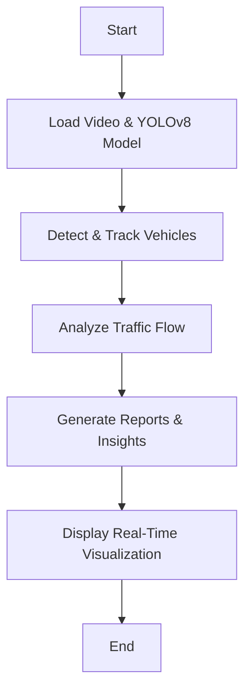

# 🚦 Traffic Analysis using YOLOv8 & Deep SORT

## 📌 Overview
This project implements a **real-time traffic analysis system** using **YOLOv8** for object detection and **Deep SORT** for object tracking. The system detects and tracks vehicles, analyzes traffic flow, and provides business insights like congestion levels and movement patterns.

---

## 📊 System Flowchart
Below is a simplified flowchart illustrating the traffic analysis process:



---

## 🔥 Features
✅ **Vehicle Detection & Tracking** 🎯 (Using YOLOv8 & Deep SORT)  
✅ **Traffic Flow Analysis** 📊 (Lane-based vehicle count & direction tracking)  
✅ **Real-Time Visualization** 🎥 (Bounding boxes, unique IDs, and entry/exit tracking)  
✅ **CSV Output** 📑 (Frame-wise object ID, movement trend, and traffic status)  
✅ **Business Insights Report** 📈 (Traffic recommendations for signal adjustments)  

---

## 🎥 Demo Video
📌 

---

## 🏗️ Installation & Setup

### 1️⃣ Clone the Repository
```bash
git clone https://github.com/YOUR_USERNAME/traffic-analysis.git
cd traffic-analysis
```

### 2️⃣ Install Dependencies
```bash
pip install -r requirements.txt
```

### 3️⃣ Run the Traffic Analysis Script
```bash
python traffic_analysis.py
```

---

## 📊 Output Files
📂 **`traffic_analysis_output.csv`** – Logs each frame's detected objects, movement direction, and traffic status.  
📂 **`business_insights.txt`** – Summarizes key findings, congestion patterns, and recommendations.  

---

## 🚦 Business Insights & Recommendations
🔴 **Heavy Traffic?** → 🚦 Increase green light duration in congested areas.  
🟡 **Moderate Traffic?** → ⚠️ Monitor and adjust signals if congestion rises.  
🟢 **Smooth Traffic?** → ✅ No immediate intervention needed.  

---

## 📌 Future Enhancements
🚀 **Pedestrian Detection** 🏃 (Tracking human movement for safety monitoring)  
📈 **AI-based Traffic Prediction** 🤖 (Using historical data for smart traffic management)  
📊 **Dashboard Integration** 🖥️ (Live data visualization on a web interface)  

---

## 🤝 Contributors
👤 **Your Name** – Rajiv Yadav  
📧 Contact: [rajivy1012@gmail.com](mailto:your.email@example.com)  

---

## ⭐ Star the Repo!
If you find this project useful, please consider **starring ⭐ the repository** and sharing it with others! 🚀

[](https://github.com/YOUR_USERNAME/traffic-analysis)

